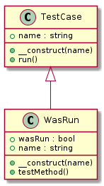
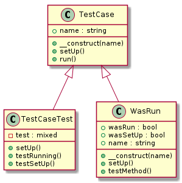
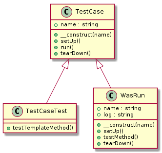
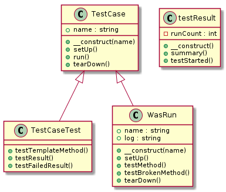

# テスト駆動開発(xUnit)を写経する

t_wadaさんが、テスト駆動開発の写経を勧めていたので、PHPで写経してみます。

https://twitter.com/t_wada/status/1334561597

## Open shell

```bash
docker-compose run --rm php_cli bash
```

## Diagrams

各章の時点でのクラス図の記録です。自作ツールのphp-class-diagramで出力しています。

### 第2部

#### 第18章 xUnitへ向かう小さな一歩



#### 第19章 前準備



#### 第20章 後片付け



#### 第21章 数え上げ


